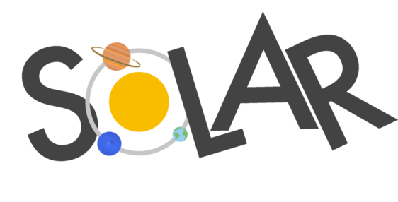
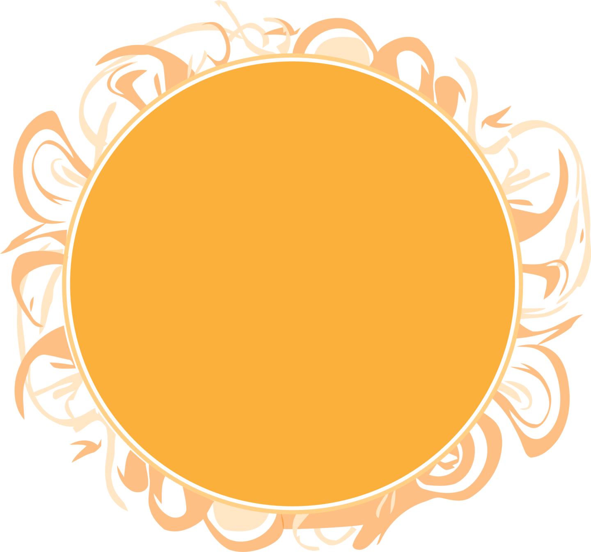
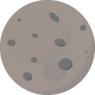
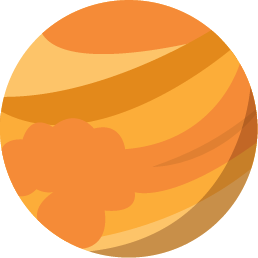
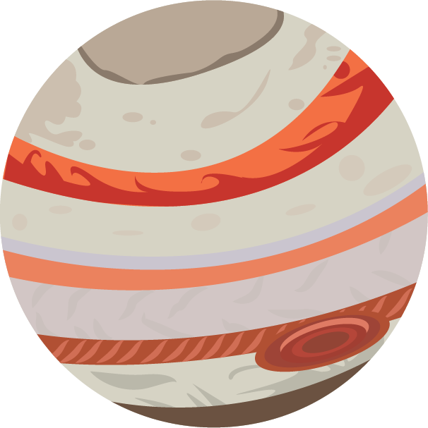
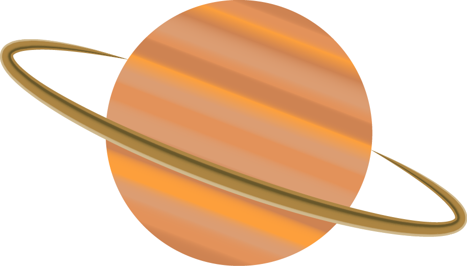
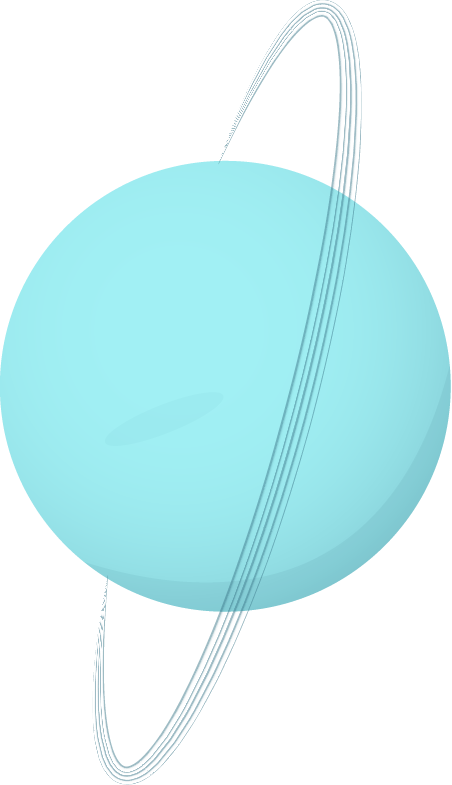
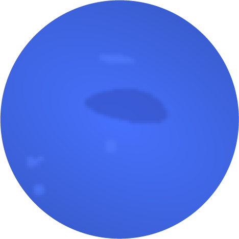

# 

A static website to explore the [Solar System](http://zer0rei.github.io/solar/).

## Illustrations

#### Sun

#### Mercury

#### Venus

#### Earth

#### Mars

#### Jupiter

#### Saturn

#### Uranus

#### Neptune

## Licence

